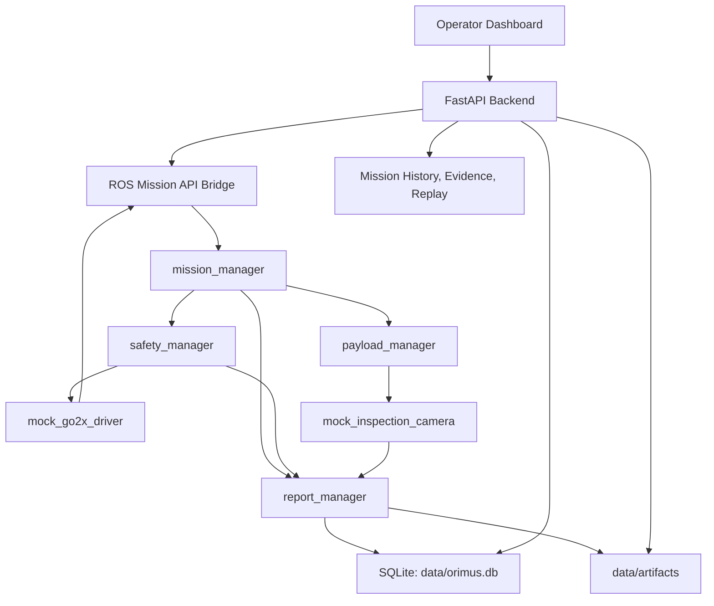
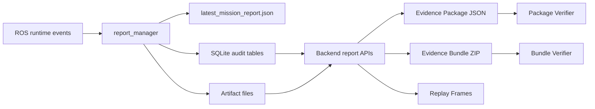

# Current Architecture Snapshot

This snapshot describes the ORIMUS system as implemented today.

It separates the working simulation-first software spine from the real robot and real payload integration seams that are intentionally deferred for CTO review.

## Current Working Flow



## Implemented Components

### Dashboard

The dashboard is served from the backend at:

```text
http://localhost:8000/dashboard/
```

It supports:

- mission selection
- mission start, pause, resume, cancel, reset
- development-mode operator ID
- runtime status
- rolling event history
- mission history filters
- report timeline and drilldown
- backend API audit browsing
- artifact links
- JSON evidence export
- ZIP evidence bundle export
- replay with speed controls and URL-addressable frames

### Backend

The backend provides:

- mission config endpoints
- operator-to-API authorization
- backend audit logging
- runtime state proxying
- mission report list/detail
- evidence package export
- evidence bundle export
- evidence bundle/package verification scripts
- artifact registry endpoints
- replay frames endpoint

### ROS 2 Runtime

The ROS 2 workspace currently includes:

- `core_interfaces`
- `mission_manager`
- `mission_api_bridge`
- `safety_manager`
- `payload_manager`
- `mock_go2x_driver`
- `mock_payloads`
- `report_manager`
- `orimus_bringup`

### Storage

SQLite database:

```text
data/orimus.db
```

Artifact directory:

```text
data/artifacts/
```

Report output:

```text
reports/latest_mission_report.json
```

## Current Contracts

### Robot Contract Today

Mocked by:

```text
ros2_ws/src/mock_go2x_driver
```

Current shape:

- requested robot commands are published by mission logic
- `safety_manager` evaluates commands
- approved commands reach the mock robot
- mock robot publishes state
- report manager records command and state history

This is the platform integration seam for the real robot adapter.

Deferred for CTO:

- vendor SDK/API choice
- real command mapping
- real telemetry mapping
- emergency stop behavior
- hardware-level limits
- deployment network/DDS strategy

### Payload Contract Today

Mocked by:

```text
ros2_ws/src/mock_payloads
```

Current shape:

- mission YAML can target `payload`
- payload requests are routed through `payload_manager`
- mock payload emits payload state, payload result, perception event
- mock payload writes a minimal artifact file
- report manager links artifacts to mission reports
- backend serves artifacts and exports them in bundles

This is the payload integration seam for real sensors.

Deferred for CTO:

- first real payload selection
- hardware transport
- payload arming/calibration
- real artifact formats
- real metadata schema
- privacy/legal restrictions

## Audit And Evidence Flow



## What Is Intentionally Not Done Yet

- Real robot adapter
- Real payload adapter
- Real perception models
- Real navigation stack
- Real autonomy planner
- Production authentication
- Hardware safety certification
- Cloud deployment
- CI pipeline

## Recommended Next Non-CTO Work

The next safe work area is improving repeatability:

- scenario test harness
- backend API docs
- dashboard usability polish
